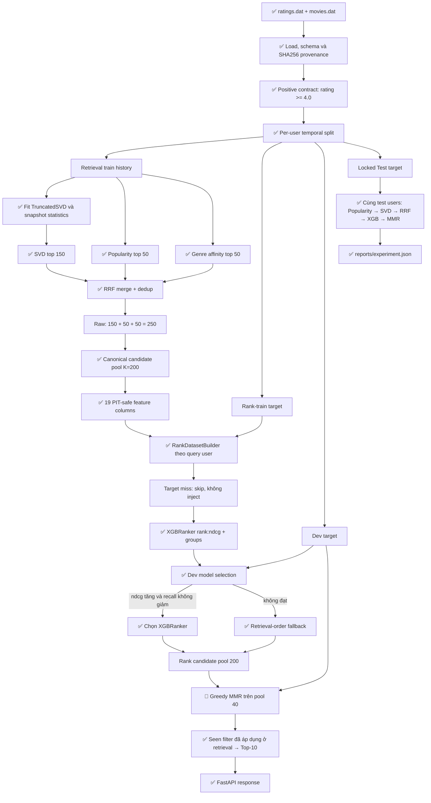

# Two-Stage Movie Recommender

[](https://github.com/haminhthong/Two-Stage-Movie-Recommender/actions/workflows/ci.yml)
[](https://www.python.org/)
[](https://fastapi.tiangolo.com/)
[](https://numpy.org/)
[](https://pandas.pydata.org/)
[](https://scikit-learn.org/)
[](https://xgboost.readthedocs.io/)
[](https://docs.pytest.org/)
[](https://docs.astral.sh/ruff/)
[](https://www.docker.com/)
[](LICENSE)

Recommender phim trên MovieLens 1M, kết hợp multi-source retrieval, group-aware
learning-to-rank và diversity reranking. Repository tập trung vào một pipeline
offline/serving có thể kiểm tra được, không mô phỏng model registry hay quy trình
triển khai nhiều phiên bản.

```text
MovieLens interactions
        ↓
Per-user temporal split
        ↓
SVD (150) + Popularity (50) + Genre (50)
        ↓
RRF merge + deduplication → canonical candidate pool K=200
        ↓
19 point-in-time features
        ↓
XGBRanker(objective="rank:ndcg", query groups)
        ↓
MMR on rerank pool K=40
        ↓
Top-10 recommendations
```

## Results trước lý thuyết

`python -m src.evaluate` ghi toàn bộ kết quả vào `reports/experiment.json` trong
một lần chạy. Năm variant dưới đây dùng cùng dataset, temporal split, test users,
candidate K và final K; không ghép số liệu giữa các experiment khác nhau.

### Full funnel

| Configuration | Recall@200 | nDCG@10 | MRR@10 | Coverage | Diversity |
| --- | ---: | ---: | ---: | ---: | ---: |
| Popularity | 0.3644 | 0.0218 | 0.0152 | 0.0486 | 0.7807 |
| SVD | 0.5223 | 0.0397 | 0.0277 | 0.2362 | 0.7604 |
| Multi-source RRF | 0.5150 | 0.0271 | 0.0186 | 0.0843 | 0.7786 |
| RRF + XGBRanker | 0.5150 | 0.0360 | 0.0242 | 0.3815 | 0.7413 |
| RRF + XGBRanker + MMR | 0.5150 | 0.0358 | 0.0240 | 0.3799 | 0.7547 |

Snapshot này được sinh từ cùng một run: MovieLens 1M, seed 42, 6.035 test users,
candidate K=200, rerank pool K=40 và final K=10. `Recall@200` là candidate
recall của Stage 1; với XGB/MMR nó vẫn là recall trước ranking. Các cột còn lại
là metric top-10; `Coverage` là catalog coverage và `Diversity` là ILD.

### Candidate funnel

| Stage-1 cutoff | Recall |
| ---: | ---: |
| 50 | 0.1829 |
| 100 | 0.3443 |
| 200 | 0.5150 |

Chi tiết test users, cold-item share, latency và Dev model selection nằm trong
`reports/experiment.json` sau khi chạy experiment.

## Bài toán & phạm vi ứng dụng

### Problem

Với lịch sử rating có timestamp của một user, hệ thống dự đoán các movie chưa
từng xuất hiện trong lịch sử trước thời điểm request. Rating `>= 4.0` là implicit
positive để học sở thích; mọi interaction, kể cả rating thấp, vẫn được xem là
`seen` và bị loại khỏi recommendation.

### Scope

- Dataset: MovieLens 1M (`ratings.dat`, `movies.dat`).
- Task: implicit next-item recommendation, leave-one-out theo user.
- Offline training, unified offline evaluation và FastAPI local/container serving.
- Không có impression log nên negative trong rank dataset là
  `unobserved-candidate proxy`, không phải negative feedback chắc chắn.
- Chưa triển khai online feedback, content encoder cho movie mới, feature store,
  model registry, traffic shifting hoặc drift monitoring.

## Luồng logic và luồng data

Đây là quy trình duy nhất chi phối source, config, artifact và report. Nhãn trạng
thái có nghĩa: ✅ đã có code/test, 🧪 thực nghiệm cần benchmark thêm, 📌 kế hoạch.



### Temporal contract

Với mỗi user có đủ positive history, ba positive cuối được giữ làm rank-train,
Dev và Test. Retrieval history chỉ gồm event trước rank-train target:

```text
older history ───── rank-train ─── Dev ─── Test ───▶ time
retrieval train       t_rank       t_val   t_test
```

Code thực hiện contract trong `src/data/split.py`:

1. Positive mới nhất → Test.
2. Positive thứ hai từ cuối → Dev.
3. Positive thứ ba từ cuối → rank training.
4. Mọi interaction trước `t_rank` → retrieval training.

User không đủ `min_positive=4` không được dùng làm holdout, nhưng toàn bộ history
của họ vẫn nằm trong retrieval training. Đây là per-user temporal holdout, không
phải mô phỏng strict global event stream giữa các user.

## Các stage chính

### Stage 1 — retrieval đa nguồn

Ba nguồn giải quyết ba tín hiệu khác nhau:

| Source | Vấn đề xử lý | Raw K |
| --- | --- | ---: |
| SVD | Collaborative preference | 150 |
| Popularity | Global prior và fallback | 50 |
| Genre | Content preference theo positive genre profile | 50 |

Raw candidate count là `150 + 50 + 50 = 250`. `MultiSourceRetriever` trong
`src/retrieval/merger.py` cộng Reciprocal Rank Fusion với `rrf_k=60`, deduplicate
theo `item_id`, giữ source-specific score/rank, rồi truncate về canonical
`candidate_k=200`. Vì vậy 250 là tổng đầu vào nguồn, còn 200 là pool chính thức.

Seen filtering dùng `seen_items_before` tại request timestamp và không mutate
retriever state. Target bị Stage 1 miss không được chèn ngược vào pool.

### Stage 2 — Group-aware Learning-to-Rank

Tên đúng là **Group-aware Learning-to-Rank scorer**, không phải pointwise scorer.
Implementation dùng:

```python
xgb.XGBRanker(
    objective="rank:ndcg",
    eval_metric="ndcg@10",
)
estimator.fit(X, y, group=groups)
```

Mỗi user là một query group. `RankDatasetBuilder` chỉ tạo nhãn dương khi target
đã xuất hiện tự nhiên trong candidate pool; nếu retrieval miss thì bỏ query đó,
không target injection. `src/ranking/trainer.py` chỉ dùng XGBRanker cho model
chính; LogisticRegression chỉ chạy khi gọi tường minh cho ablation/test.

#### 19 features

`src/ranking/features.py` cố định schema `rank-features-v1` gồm:

```text
svd_score, svd_rank,
popularity_retrieval_score, popularity_rank,
genre_retrieval_score, genre_rank,
rrf_score, source_count,
user_positive_count, user_interaction_count, user_avg_rating, genre_entropy,
item_positive_count, item_rating_count, item_avg_rating,
item_popularity_percentile, item_genre_count,
genre_affinity, genre_overlap_count
```

Các statistic lịch sử được dựng trước `as_of_timestamp` khi training. Serving
không có interaction stream để cập nhật động; nó dùng statistic đã đóng băng
trong training snapshot, trong khi request-time seen filtering vẫn ngăn gợi ý
movie đã quan sát.

#### Dev model selection

Train so sánh retrieval order với XGBRanker trên Dev. XGB chỉ được chọn khi:

```text
xgb_ndcg@10 > retrieval_ndcg@10
và
xgb_recall@10 >= retrieval_recall@10
```

Nếu không đạt, config ghi `selected_ranker="retrieval_order"` và serving giữ
thứ tự retrieval. Đây là model selection trên Dev, không phải release gate hay
promotion lifecycle.

### Stage 3 — MMR diversity

`src/reranking/diversity.py` dùng greedy MMR với genre Jaccard similarity:

```text
candidate pool 200 → ranking → rerank pool 40 → final 10
```

`lambda=1` giữ relevance thuần, `lambda=0` ưu tiên diversity thuần. Train khảo
sát lambda trên Dev và chọn ILD cao nhất với ràng buộc nDCG không giảm quá 2%
so với baseline đã chọn. Đây là diversity tuning có relevance constraint; MMR
không được tune trên Test.

## Cold start và failure behavior

| Tình huống | Hành vi hiện tại |
| --- | --- |
| New user | Popularity; nếu có preferred genres thì ưu tiên genre phù hợp |
| User ít history | Dùng tín hiệu khả dụng, fallback Popularity/Genre |
| Ranker không khả dụng hoặc không được chọn | Retrieval order rồi MMR |
| Stage 1 không có candidate | Popularity fallback, vẫn loại effective seen items |
| New movie | Chỉ được gợi ý nếu đã có trong catalog/metadata snapshot; chưa có content encoder online |
| Recent session items | Thêm vào request context và seen set, không mutate model |

## Model files và experiment provenance

`src/model_io.py` chỉ lưu/nạp model phẳng:

```text
models/
├── user_embeddings.npy
├── item_embeddings.npy
├── ranker.joblib          # ranker đã train; serving chỉ dùng khi Dev chọn
├── metadata.joblib
└── config.json
```

Loader chỉ kiểm tra các invariant cần thiết: file bắt buộc, embedding 2 chiều,
embedding dimension khớp, số user/item khớp metadata, config hợp lệ và ranker có
đúng 19 input features. Không có `production.json`, candidate directory,
promotion script, artifact hash lifecycle hay release pointer.

`config.json` giữ provenance của experiment: dataset/checksum, seed, candidate
contract, split, feature schema, Dev metrics và MMR lambda. Kết quả so sánh Test
của một run duy nhất nằm ở `reports/experiment.json`.

## Current System và Production Roadmap

### Current System

| Thành phần | Trạng thái | Phạm vi |
| --- | --- | --- |
| MovieLens loader, positive contract và temporal split | ✅ Implemented | Offline data preparation |
| SVD + Popularity + Genre + RRF | ✅ Implemented | Stage 1, raw 250 → K=200 |
| 19 PIT-safe features | ✅ Implemented | Stage 2 input |
| Group-aware XGBRanker | ✅ Implemented | `rank:ndcg` với query groups |
| Dev model selection và retrieval fallback | ✅ Implemented | Freeze trước Test |
| Greedy genre MMR | 🧪 Experimental | Pool 40, tune lambda trên Dev |
| Unified funnel report | ✅ Implemented | `reports/experiment.json` |
| FastAPI local/container serving | ✅ Implemented | Health, recommend, cold-start |
| Online feedback, feature store, registry, monitoring | 📌 Planned | Chưa có trong MovieLens repo |

### Production Roadmap

Các mục dưới đây chỉ là hướng mở rộng khi có dữ liệu vận hành thật, không phải
khẳng định đã triển khai:

- 📌 impression logs và propensity-aware negative sampling;
- 📌 strict global point-in-time evaluation trên event stream;
- 📌 content encoder và ingestion cho movie mới;
- 📌 load test p50/p95/p99 dưới workload thật;
- 📌 external artifact storage, registry, monitoring và rollback.

## Cấu trúc thư mục

```text
Two-Stage-Movie-Recommender/
├── src/
│   ├── config.py              # TrainConfig duy nhất
│   ├── model_io.py            # save_model / load_model
│   ├── train.py               # fit model và Dev selection
│   ├── evaluate.py            # unified Test experiment
│   ├── api.py                 # FastAPI endpoints
│   ├── data/                  # loader, split, interaction contract
│   ├── retrieval/             # SVD, popularity, genre, RRF
│   ├── ranking/               # 19 features, dataset, XGBRanker
│   ├── reranking/             # greedy genre MMR
│   ├── evaluation/            # metrics, latency, funnel helpers
│   └── serving/               # Recommender và cold-start policy
├── scripts/
│   └── download_data.py
├── tests/
├── data/raw/ml-1m/            # local dataset, không commit raw files
├── models/                    # local model files, không commit binary
├── reports/                   # experiment.json sau khi evaluate
├── .github/workflows/ci.yml
├── Dockerfile
├── Makefile
├── requirements.txt
├── README.md
└── LICENSE
```

## Cài đặt và chạy

Yêu cầu Python 3.10+.

```bash
python -m venv .venv
# Windows: .venv\\Scripts\\activate
# Linux/macOS: source .venv/bin/activate
python -m pip install --upgrade pip
python -m pip install -r requirements.txt
```

Tải MovieLens 1M nếu chưa có dữ liệu:

```bash
python scripts/download_data.py
```

Huấn luyện và tạo năm model variant trên cùng Test protocol:

```bash
python -m src.train
python -m src.evaluate
```

Có thể chạy nhanh trên máy yếu bằng giới hạn explicit trong Python, nhưng không
được gọi kết quả đó là full-data benchmark:

```python
from src.config import TrainConfig
from src.train import train_model

train_model(TrainConfig(max_rank_train_users=1000, max_val_users=500))
```

Chạy test và lint:

```bash
python -m ruff check --no-cache src tests scripts
python -m ruff format --no-cache --check src tests scripts
python -m pytest -q
```

## API

Khởi động local server:

```bash
python -m uvicorn src.api:app --host 0.0.0.0 --port 8000
```

Endpoint chính:

```bash
curl "http://localhost:8000/health"
curl "http://localhost:8000/recommend/1?k=10"
curl "http://localhost:8000/recommend/1?k=10&debug=true"
curl -X POST "http://localhost:8000/recommend/cold-start" \
  -H "Content-Type: application/json" \
  -d "{\"preferred_genres\":[\"Action\",\"Sci-Fi\"],\"k\":10}"
```

`debug=true` mới trả latency, score breakdown và pipeline counts. Request có thể
truyền `recent_items=1,2,3`; các ID này chỉ làm tăng effective seen set của
request hiện tại.

## Docker

```bash
docker build -t two-stage-recommender .
docker run --rm -p 8000:8000 two-stage-recommender
```

Container cần có `models/` đã được tạo bằng `python -m src.train`; nếu chưa có,
`/health` trả `degraded` thay vì crash import.

## CI và repo cleanliness

GitHub Actions chạy trên Python 3.10 và 3.11, đồng thời build Docker image. Job
Python có ba bước bắt buộc:

1. Ruff lint.
2. Ruff format check.
3. Pytest.

Job Docker chạy `docker build --tag two-stage-recommender:ci .` để bắt lỗi
Dockerfile và build context ngay trên CI.

`httpx` được pin trong `requirements.txt` vì FastAPI/Starlette `TestClient` cần
HTTP client này. Raw data, model binary, report sinh tự động, cache và
`__pycache__` đều bị ignore; repository chỉ giữ source, test, config cần thiết
và tài liệu này.

Không thêm MLflow, Redis, Kafka, Airflow, Kubernetes hay microservice chỉ để làm
repo trông giống production. Ưu tiên hiện tại là một experiment sạch chứng minh
đóng góp của retrieval → ranking → diversity trên cùng protocol.

## License

MIT. Xem [LICENSE](LICENSE).
