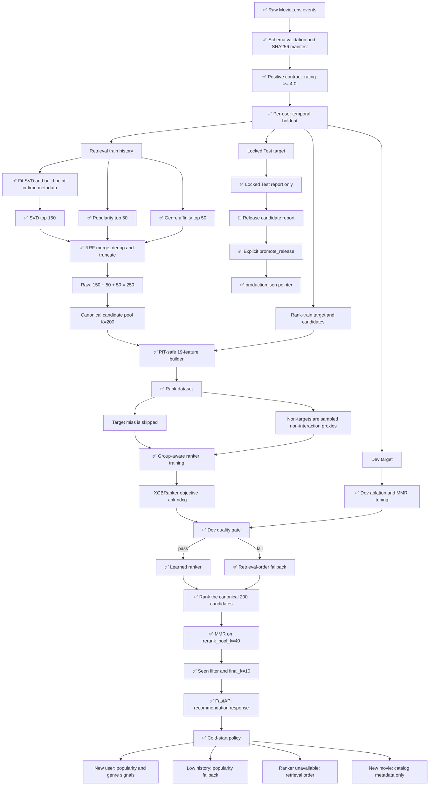

# Two-Stage Movie Recommender

Hệ thống gợi ý phim hai tầng trên MovieLens 1M. Pipeline hiện tại thống nhất một candidate contract cho train, Dev, Locked Test và serving:

- Stage 1: SVD + Popularity + Genre tạo candidate thô.
- RRF merge, deduplication và truncate về canonical pool K=200.
- Stage 2: group-aware Learning-to-Rank bằng XGBRanker với objective rank:ndcg và query groups.
- Stage 3: MMR trên pool 40, giữ relevance guardrail và trả tối đa 10 phim.
- Khi learned ranker không qua quality gate hoặc artifact ranker không khả dụng, hệ thống fallback về retrieval order.

> README này mô tả code đang có trong repository. Các số liệu trong phần Results là snapshot từ reports hiện tại, không phải cam kết SLA production.

## 1. Results trước, lý thuyết sau

### 1.1. Full funnel snapshot

Bảng dưới đây đặt toàn bộ funnel lên cùng một trang. Dấu — nghĩa là report hiện tại không ghi metric đó cho cấu hình tương ứng; không tự suy diễn thành 0.

| Configuration | Recall@200 | nDCG@10 | MRR@10 | Coverage | Diversity |
| --- | ---: | ---: | ---: | ---: | ---: |
| Popularity | — | 0.0215 | 0.0147 | — | — |
| SVD | — | — | — | — | 0.7573 ILD |
| Multi-source RRF | 0.5248 candidate recall | — | — | — | — |
| + XGBRanker | — | 0.0239 | — | — | — |
| + MMR | — | 0.0239 | 0.0143 | 0.4834 catalog | 0.7358 ILD |

Các giá trị trên lấy từ reports/test_metrics.json và reports/ablation.json. Các report cũ không phải cùng một release protocol hoàn chỉnh, vì vậy cần đọc cùng metadata và không dùng trực tiếp để chọn model mới.

### 1.2. Kết quả Locked Test đang có

| Metric | Giá trị | Diễn giải |
| --- | ---: | --- |
| target_in_catalog_rate | 99.98% | Target có mặt trong catalog |
| candidate_recall@50 | 25.58% | Target lọt vào pool sau 50 candidate đầu |
| candidate_recall@100 | 37.65% | Target lọt vào pool sau 100 candidate đầu |
| candidate_recall@200 | 52.48% | Recall của Stage 1 ở canonical pool |
| final recall@10 | 0.0557 | Hit rate/recall sau ranker và MMR |
| final nDCG@10 | 0.0239 | Chất lượng thứ hạng có trọng số vị trí |
| final MRR@10 | 0.0143 | Vị trí xuất hiện đầu tiên của target |
| catalog coverage | 48.34% | Tỷ lệ catalog xuất hiện trong recommendation |
| ILD | 0.7358 | Intra-List Diversity |
| user coverage | 100% | Tỷ lệ user có output |

### 1.3. Latency snapshot

Snapshot cũ ghi nhận p50/p95 lần lượt là 3.24/14.69 ms cho retrieval, 44.45/172.99 ms cho ranking và 48.90/182.81 ms cho total. Đây là số liệu chẩn đoán của report, không phải SLA; cần benchmark lại theo hardware, batch size và release.

## 2. Bài toán và phạm vi ứng dụng

Input là lịch sử rating MovieLens 1M gồm user, movie, rating, timestamp và genres. Hệ thống biến rating thành implicit positive khi rating >= 4.0, đồng thời giữ toàn bộ interaction trước thời điểm request cho seen-item filtering.

Output mặc định là 10 movie chưa từng xuất hiện trong lịch sử của user tại thời điểm request; API cho phép `k` từ 1 đến 50. Pipeline ưu tiên:

1. Không rò rỉ tương lai qua split hoặc feature snapshot.
2. Đưa item đúng vào candidate pool trước khi tối ưu rank.
3. Duy trì fallback deterministic khi ranker lỗi hoặc không qua gate.
4. Theo dõi riêng retrieval quality, ranking quality, diversity, coverage và latency.

Phạm vi hiện tại là offline training, offline evaluation và FastAPI serving cục bộ/container. Chưa có impression log, feedback online, feature store, model registry bên ngoài hoặc monitoring production đầy đủ.

## 3. Luồng logic duy nhất chi phối code, config và report

Sơ đồ dưới đây là source of truth cho thứ tự xử lý. Các nhãn trạng thái dùng theo quy ước:

- ✅ Implemented: có code và test/smoke tương ứng.
- 🧪 Experimental: có trong pipeline/report nhưng cần benchmark hoặc tuning lại.
- 📌 Planned: chưa được triển khai hoàn chỉnh.

Không có bước nào được phép tự chèn target vào candidate pool. Nếu Stage 1 miss target, sample đó bị loại khỏi rank-training group và được báo cáo riêng. Điều này giữ cho ranking metric phản ánh đúng lỗi funnel.

## 4. Data contract và temporal protocol

### 4.1. Positive, seen và negative proxy

- Positive: rating >= 4.0.
- Seen filter: mọi interaction đã xảy ra trước request timestamp, kể cả rating thấp.
- User genre profile: chỉ dùng positive interaction, không dùng rating thấp để tạo sở thích.
- Negative trong rank train: candidate Stage 1 không phải target. Vì MovieLens không có impression logs, đây chỉ là sampled non-interaction proxy, không phải negative feedback thật.
- Target injection: không cho phép. Target chỉ được học nếu đã lọt vào candidate pool tự nhiên.

### 4.2. Per-user temporal holdout

Với mỗi user đủ lịch sử positive, các event cuối được tách theo thứ tự thời gian:

1. Retrieval train: lịch sử trước rank-train target.
2. Rank-train target: positive thứ ba từ cuối.
3. Dev target: positive thứ hai từ cuối.
4. Locked Test target: positive mới nhất.

Đây là per-user temporal holdout. Nó bảo vệ thứ tự thời gian trong từng user nhưng không phải strict global point-in-time simulation giữa các user khác nhau.

Feature builder và retriever nhận as_of timestamp. Mọi thống kê user/item/genre dùng trong một sample phải được cắt tại timestamp đó. Request online có thể bổ sung recent_items, nhưng các item này chỉ là context của request và cũng tham gia seen filtering.

## 5. Stage 1 — Multi-source retrieval

### 5.1. Candidate contract

Tổng nguồn thô là 250, không phải 200:

    150 SVD + 50 Popularity + 50 Genre = 250 raw candidates
                         |
                         v
             RRF merge + deduplication
                         |
                         v
                 canonical pool K=200

Sau deduplication, một movie có thể xuất hiện ở nhiều nguồn nhưng chỉ giữ một Candidate. Metadata source-specific vẫn được giữ để ranking:

- source_scores: điểm của từng source nếu movie xuất hiện ở source đó.
- source_ranks: rank 1-based của từng source.
- source_count: số source đã lấy được movie.
- rrf_score: tổng 1 / (rrf_k + source_rank) trên các source có mặt.

RRF dùng rrf_k=60. Candidate order cuối cùng được sắp theo rrf_score giảm dần rồi truncate về candidate_k=200. Seen items bị loại theo seen set của request, không mutate state dùng cho request kế tiếp.

Trong `TrainConfig.candidate_contract`, hai khái niệm này được ghi tách biệt
thành `raw_source_total_k=250` và `canonical_k=200`, tránh hiểu nhầm tổng số
candidate nguồn là kích thước pool cuối.

### 5.2. Ba retriever

- SVD: TruncatedSVD tạo user/item latent vectors; điểm là dot product trên item chưa seen.
- Popularity: điểm dựa trên count/rating prior của item trong snapshot.
- Genre: lấy positive genre profile của user rồi ưu tiên item phù hợp genre chưa seen.
- Không đủ history: SVD có thể không tạo được tín hiệu cá nhân; popularity và genre là fallback retrieval chính.

## 6. Stage 2 — Group-aware Learning-to-Rank

Tên đúng của tầng này là **Group-aware Learning-to-Rank scorer**. Không gọi là pointwise scorer, vì code dùng:

    XGBRanker(objective="rank:ndcg")

và truyền query group cho các row của từng user. Có LogisticRegression fallback trong môi trường thiếu XGBoost, nhưng contract chính vẫn là XGBRanker; model type được ghi vào artifact config.

### 6.1. 19 features hiện tại

Feature schema version là rank-features-v1:

1. svd_score
2. svd_rank
3. popularity_retrieval_score
4. popularity_rank
5. genre_retrieval_score
6. genre_rank
7. rrf_score
8. source_count
9. user_positive_count
10. user_interaction_count
11. user_avg_rating
12. genre_entropy
13. item_positive_count
14. item_rating_count
15. item_avg_rating
16. item_popularity_percentile
17. item_genre_count
18. genre_affinity
19. genre_overlap_count

Các source score và source rank có giá trị riêng, không bị gộp thành một feature chung. Item/user statistics được lấy từ point-in-time snapshot để tránh lookahead leakage.

### 6.2. Rank dataset

Mỗi user là một query group. Target positive được gán y=1 nếu target xuất hiện trong candidate pool; các candidate còn lại là y=0 proxy. Nếu target bị Stage 1 miss, toàn bộ sample user đó không được dùng để giả tạo positive cho ranker.

Training chỉ dùng rank-train split. Dev dùng để chọn/tune quality gate và MMR config. Locked Test chỉ chạy sau khi pipeline đã freeze.

### 6.3. Quality gate và fallback

Train tạo Release Candidate dưới models/candidates/<version>. Ranker chỉ trở thành learned ranker active nếu vượt gate trên Dev. Nếu không vượt:

- serving dùng retrieval order;
- evaluation vẫn ghi rõ ranker không active;
- không dùng WeightedFusionRanker như một hành vi ngầm khác với contract;
- artifact vẫn giữ model/config để audit, nhưng production pointer không tự đổi.

## 7. Stage 3 — MMR và business guardrails

Serving và evaluation dùng cùng contract:

    candidate_k=200 -> rank all 200 -> rerank_pool_k=40 -> final_k=10

MMR tối ưu tuần tự trên top 40 candidate sau retrieval/ranking. Seen filter được áp dụng ở retrieval trước khi ranking và candidate pool được giới hạn ở top 40 trước khi MMR. Similarity giữa phim dùng genre bitmask và bit_count:

    intersection = (mask_a & mask_b).bit_count()
    union = (mask_a | mask_b).bit_count()
    jaccard = intersection / union

MMR lambda mặc định là 0.95. Dev có thể khảo sát candidate pool, nhưng không được biến kết quả trên Locked Test thành tuning signal. MMR pool 40 là engineering trade-off hiện tại, không phải chứng minh toán học tối ưu.

## 8. Cold-start và failure behavior

| Tình huống | Hành vi hiện tại |
| --- | --- |
| New user, không có lịch sử | Popularity retrieval; nếu có preferred genres thì cộng thêm Genre retrieval |
| User có ít history | Dùng tín hiệu khả dụng; thiếu SVD thì fallback popularity/genre |
| Ranker unavailable | Giữ candidate order từ Stage 1, sau đó MMR |
| Stage 1 không có candidate | Popularity fallback, vẫn tôn trọng effective seen items |
| New movie | Movie phải có mặt trong catalog metadata/retrieval snapshot; chưa có content encoder hoặc online item ingestion riêng |
| Recent session items | Cộng vào request context và seen filter; không mutate global model state |
| Artifact sai hash/version | Loader fail-closed; API trả trạng thái degraded hoặc lỗi phù hợp |

New movie hiện chưa có một nhánh content-based cold-item model hoàn chỉnh. Vì vậy không nên quảng bá repository như đã giải quyết đầy đủ item cold start.

## 9. Current System và Production Roadmap

### Current System

| Thành phần | Trạng thái | Ghi chú |
| --- | --- | --- |
| MovieLens loader và SHA256 manifest | ✅ Implemented | Đọc ratings, movies, users và tạo provenance |
| Per-user temporal split | ✅ Implemented | Retrieval, rank, Dev, Test |
| SVD + Popularity + Genre | ✅ Implemented | 150/50/50 raw source contract |
| RRF merge/dedup/truncate | ✅ Implemented | Canonical K=200 |
| PIT-safe feature builder | ✅ Implemented | 19 feature schema |
| Group-aware XGBRanker | ✅ Implemented | LogisticRegression fallback khi thiếu dependency |
| Dev gate và retrieval fallback | ✅ Implemented | Không tự promote |
| MMR pool 40 | 🧪 Experimental | Cần benchmark theo release |
| Offline funnel report | ✅ Implemented | Retrieval, rank, final, coverage, diversity |
| FastAPI serving | ✅ Implemented | health, recommend, cold-start |
| Versioned artifacts | ✅ Implemented | manifest, hash, schema, production pointer |
| Online feedback/impression logs | 📌 Planned | Chưa có trong MovieLens |
| External feature store/monitoring | 📌 Planned | Ngoài phạm vi repository |

### Production Roadmap

- 📌 Thêm impression logs và propensity-aware negative sampling.
- 📌 Chạy strict global point-in-time evaluation khi dữ liệu có event stream thật.
- 📌 Thêm content encoder cho new movie và item ingestion online.
- 📌 Chạy load test p50/p95/p99 dưới workload production.
- 📌 Thêm model registry, drift monitoring, alerting và rollback tự động.
- 📌 Tách offline artifact storage khỏi filesystem local.

## 10. Artifact lifecycle

Train ghi một Release Candidate, không tự thay production pointer:

    models/
    ├── production.json
    ├── candidates/
    │   └── <version>/
    │       ├── config.json
    │       ├── data_manifest.json
    │       ├── temporal_split_manifest.json
    │       ├── retrieval/
    │       ├── ranking/
    │       └── metadata/

Loader kiểm tra:

- version trong path, config và manifest phải khớp;
- hash và schema version phải hợp lệ;
- artifact thiếu hoặc hash sai bị từ chối;
- production pointer chỉ đổi qua promote_release;
- release candidate không được dùng ngầm như production.

Ví dụ promote sau khi đã xem Dev và Locked Test:

~~~bash
python -c "from src.artifacts.release import promote_release; from src.utils import load_json; promote_release('models', 'candidates/vX', load_json('reports/test_metrics.json'))"
~~~

## 11. Cấu trúc thư mục

~~~text
Two-Stage-Recommender/
├── .github/workflows/ci.yml
├── configs/
│   ├── data.yaml
│   ├── retrieval.yaml
│   ├── ranking.yaml
│   └── serving.yaml
├── data/
│   ├── raw/ml-1m/              # MovieLens 1M, không commit dữ liệu mới ngoài phạm vi
│   └── processed/
├── models/
│   ├── production.json
│   ├── candidates/
│   └── legacy files            # artifact cũ giữ để tương thích/migration
├── reports/
│   ├── test_metrics.json
│   └── ablation.json
├── scripts/download_data.py
├── src/
│   ├── api.py
│   ├── config.py
│   ├── train.py
│   ├── evaluate.py
│   ├── utils.py
│   ├── data.py                 # facade/backward-compatible exports
│   ├── data/                   # schema, loader, interactions, split, manifest
│   ├── retrieval/              # SVD, popularity, genre, RRF merger
│   ├── ranking/                # dataset, features, model, trainer, scorer
│   ├── reranking/              # MMR và business rules
│   ├── evaluation/             # metrics, latency, funnel evaluator
│   ├── artifacts/              # schema, writer, loader, release
│   └── serving/                # cold-start và online recommender
├── tests/
│   ├── conftest.py             # fixture nhỏ cho clone sạch/CI
│   └── test_*.py
├── Dockerfile
├── Makefile
├── requirements.txt
└── pytest.ini
~~~

Ghi chú: src/ranking/diversity.py là compatibility shim để giữ import cũ; implementation chính nằm ở src/reranking/diversity.py. Các file __init__.py và .gitkeep rỗng nhưng có chủ đích: package marker và giữ thư mục rỗng trong Git, không nên xóa tự động.

## 12. Cài đặt

Yêu cầu Python 3.10 trở lên. Dockerfile hiện chạy Python 3.11.

~~~powershell
python -m venv .venv
.venv/Scripts/Activate.ps1
python -m pip install --upgrade pip
python -m pip install -r requirements.txt
~~~

`requirements.txt` chứa cả dependency chạy ứng dụng và công cụ kiểm tra
(`pytest`, `ruff`). CI không cần commit dataset/model binary: `tests/conftest.py`
tạo một schema-5 release tối thiểu có manifest/hash/policy chỉ khi chưa có
`models/production.json`. Khi chạy local với production artifact thật, fixture
này không ghi đè artifact.

Tải dữ liệu MovieLens 1M và kiểm tra checksum:

~~~powershell
python scripts/download_data.py
~~~

Nếu dữ liệu raw đã tồn tại, script sẽ kiểm tra file và manifest thay vì âm thầm dùng input sai.

## 13. Chạy train, evaluate, test và API

### 13.1. Train

~~~powershell
python -m src.train
~~~

Train thực hiện:

1. Load và validate dữ liệu.
2. Tạo manifest.
3. Tạo per-user temporal split.
4. Fit SVD trên retrieval train.
5. Sinh 150/50/50 raw candidates.
6. RRF merge về K=200.
7. Build rank dataset với PIT-safe features.
8. Train grouped ranker và chạy Dev gate.
9. Ghi Release Candidate, không tự activate production.

### 13.2. Evaluation

~~~powershell
python -m src.evaluate
~~~

Evaluation tách:

- Locked Test: funnel report chính sau khi pipeline freeze.
- Dev: baseline, ablation và MMR study.
- Conditional metrics: chỉ đo ranking quality trên sample target đã lọt candidate.
- Rescue/source metrics: theo dõi source nào đóng góp vào candidate pool.

### 13.3. Test

~~~powershell
python -m pytest -q
~~~

CI chạy cùng contract trên Python 3.10 và 3.11, theo thứ tự: Ruff lint, Ruff
format check rồi pytest. Bộ test fixture chỉ kiểm tra logic/API/fallback; số
liệu recommender thật vẫn phải được tạo từ MovieLens bằng train/evaluate.

Hoặc dùng Makefile:

~~~powershell
make setup
make download
make train
make evaluate
make test
make serve
~~~

Windows không có make có thể gọi trực tiếp các lệnh Python ở trên.

### 13.4. API

~~~powershell
python -m uvicorn src.api:app --reload --host 127.0.0.1 --port 8000
~~~

Health:

~~~powershell
curl http://127.0.0.1:8000/health
~~~

Recommendation:

~~~powershell
curl "http://127.0.0.1:8000/recommend/1?k=10&recent_items=260,1197&include_scores=true"
~~~

Cold start:

~~~powershell
curl -X POST "http://127.0.0.1:8000/recommend/cold-start" -H "Content-Type: application/json" -d "{\"preferred_genres\":[\"Animation\",\"Children's\"],\"k\":3}"
~~~

Swagger UI: http://127.0.0.1:8000/docs

## 14. Docker

~~~powershell
docker build -t two-stage-recommender .
docker run --rm -p 8000:8000 two-stage-recommender
~~~

Container chỉ phục vụ được nếu artifact production và dữ liệu cần thiết đã được copy/mount vào image/runtime.

## 15. Giới hạn và quyết định kỹ thuật

- MovieLens không có impression logs: negative là proxy, không phải dislike.
- Per-user holdout không tương đương global event-time simulation.
- Candidate recall là nút thắt của funnel; ranker không cứu được target bị Stage 1 miss.
- Ranking feature phải dùng snapshot trước as_of; không dùng aggregate của tương lai.
- Seen filtering là hard rule và áp dụng ở retrieval/serving.
- Ranker fallback phải deterministic để dễ audit và không đổi semantics giữa evaluation và serving.
- MMR tăng diversity nhưng có thể làm giảm relevance; pool 40 là guardrail hiện tại.
- Report lịch sử không thay thế quality gate của release mới.

## 16. Files quan trọng để review

- src/config.py: default contract và các dataclass cấu hình.
- src/data/split.py: temporal boundaries và seen history.
- src/retrieval/merger.py: raw source counts, RRF, dedup, truncate.
- src/ranking/features.py: feature schema và point-in-time snapshots.
- src/ranking/trainer.py: grouped XGBRanker và fallback.
- src/evaluation/evaluator.py: funnel metrics và conditional metrics.
- src/serving/recommender.py: online fallback, recent context và MMR.
- src/artifacts/loader.py: fail-closed validation.
- tests/test_contract_regressions.py: regression cho target miss, RRF order và request-local seen.

## License

MIT License. Xem LICENSE.
