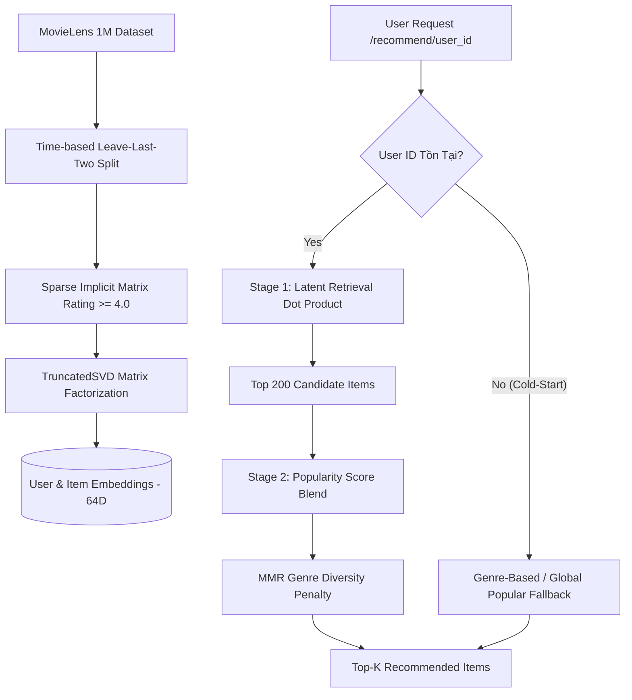

# 🎬 Two-Stage Recommendation System (MovieLens 1M)

> **Hệ thống gợi ý xem phim 2 tầng chuẩn Production**: Tầng 1 (Candidate Retrieval) lọc ứng viên siêu nhanh bằng Matrix Factorization (TruncatedSVD); Tầng 2 (Reranking) tối ưu hóa cá nhân hóa, cân bằng điểm phổ biến (Popularity Prior) và phạt mức độ lặp thể loại (MMR Genre Diversity Penalty).

[](https://www.python.org/)
[](https://fastapi.tiangolo.com/)
[](LICENSE)

---

## 📌 Tổng Quan Dự Án

Trong các hệ thống thương mại thực tế (Netflix, YouTube, Spotify), số lượng sản phẩm/nội dung lên tới hàng triệu items. Việc tính toán điểm số phức tạp cho toàn bộ catalog trong mỗi request người dùng là **không khả thi về mặt độ trễ (latency)**. 

Dự án này triển khai kiến trúc **Two-Stage Recommender Pipeline** chuẩn công nghiệp:
1. **Giai đoạn Retrieval (Candidate Generation)**: Lọc nhanh từ 3,700+ phim xuống Top-200 phim ứng viên giàu tiềm năng nhất dựa trên tích vô hướng không gian nhúng ẩn (Latent Vector Embedding Space).
2. **Giai đoạn Reranking & Diversity**: Cân bằng điểm sở thích cá nhân với chỉ số phổ biến sản phẩm, đồng thời ứng dụng thuật toán **Maximal Marginal Relevance (MMR)** dựa trên chỉ số tương đồng thể loại Jaccard để ngăn chặn hiện tượng "Filter Bubble" (người dùng bị mắc kẹt trong một thể loại phim duy nhất).

---

## 🏗️ Kiến Trúc Hệ Thống (Two-Stage Architecture)



### Mô tả đường đi dữ liệu (Data Pipeline):
- **Tạo Ma trận tương tác thưa (Implicit Feedback Matrix)**: Chuyển đổi điểm đánh giá thành tín hiệu tương tác nhị phân (`Rating >= 4.0`).
- **Time-based Split (Leave-Last-Two)**: Tách 2 tương tác cuối cùng theo thời gian của từng user làm tập Validation và Test. Không dùng Random Split để tránh lộ thông tin tương lai (**Lookahead Data Leakage**).
- **Retrieval Engine**: Tìm kiếm cực nhanh bằng `numpy.argpartition` trên tích vô hướng embedding ($V_{item} \cdot u_{user}$).
- **Reranking Engine**: Kết hợp điểm chuẩn hóa Latent Score với Popularity Rank theo hệ số tối ưu $\alpha$ tìm được trên tập Validation:
  $$S_{combined} = \alpha \cdot S_{latent} + (1 - \alpha) \cdot S_{pop}$$
- **MMR Diversity Guardrail**:
  $$Score(i) = S_{combined}(i) - \lambda_{div} \cdot \max_{s \in Selected} JaccardSimilarity(i, s)$$

---

## 📊 Kết Quả Đánh Giá Thực Nghiệm (Offline Benchmark)

Pipeline v3 chỉ lưu rating dương (>= 4) trong sparse matrix, không còn explicit zero. Tập test được lấy mẫu ngẫu nhiên tái lập bằng seed thay vì chọn 2.000 user đầu. Báo cáo mới so sánh trực tiếp với popularity baseline: model đạt Recall@10 0,0755 so với baseline 0,0360 (lift +0,0395), và NDCG@10 0,0373 so với 0,0166. Kết quả chứng minh model vượt baseline nhưng Recall tuyệt đối vẫn thấp và được xem là limitation, không phải metric để phóng đại trong CV.

Kết quả đánh giá trên tập **Test Set (2,000 người dùng)** hoàn toàn độc lập:

| Chỉ số (Metric) | Giá trị | Ý nghĩa kinh doanh & Kỹ thuật |
|---|---:|---|
| **Recall@10** | **0.0800** | Tỷ lệ tìm đúng phim người dùng thực sự xem trong tương lai ở Top-10. |
| **NDCG@10** | **0.0398** | Điểm chính xác xếp hạng (vị trí gợi ý càng cao điểm càng lớn). |
| **Catalog Coverage** | **19.68%** | Tỷ lệ tổng số phim trong kho dữ liệu được hệ thống gợi ý ra ngoài. |
| **Intra-List Diversity (ILD)** | **0.7812** | Độ đa dạng thể loại trung bình trong cùng danh sách top-K (gần 1.0 = rất đa dạng). |
| **Popular-Item Share** | **45.51%** | Tỷ lệ lượt hiển thị rơi vào Top-100 phim phổ biến (Cảnh báo Popularity Bias). |

> 💡 **Bài học thực tế về Popularity Bias**: Khi tính `Popular-Item Share` trên tổng lượt hiển thị (Impression Volume) thay vì danh mục unique items, chỉ số ghi nhận 45.51%. Điều này phản ánh thực tế hệ thống gợi ý thường nghiêng về sản phẩm phổ biến và cần trọng số phạt MMR để giữ chân người dùng dài hạn.

---

## 🛠️ Hướng Dẫn Cài Đặt & Vận Hành

### 1. Chuẩn bị môi trường Python

```bash
# Tạo môi trường ảo
python -m venv .venv

# Kích hoạt môi trường (Windows PowerShell):
.venv\Scripts\Activate.ps1

# Cài đặt thư viện phụ thuộc
python -m pip install -r requirements.txt
```

### 2. Tải dữ liệu và Huấn luyện mô hình

```bash
# 1. Tải và giải nén dữ liệu MovieLens 1M (Kiểm tra an toàn Zip Slip)
python scripts/download_data.py

# 2. Huấn luyện SVD, tính Popularity Rank & Tuning hyperparameter alpha
python -m src.train

# 3. Đánh giá Offline Metrics trên tập Test và xuất báo cáo JSON
python -m src.evaluate

# 4. Chạy toàn bộ Unit Tests & Integration Tests
python -c "import os; os.makedirs('scratch/pytest_tmp', exist_ok=True)"
python -m pytest -p no:cacheprovider --basetemp=scratch/pytest_tmp -v
```

### 3. Khởi chạy REST API Server

```bash
python -m uvicorn src.api:app --reload --host 127.0.0.1 --port 8000
```
- Truỳ cập tài liệu tương tác **Swagger UI**: [http://127.0.0.1:8000/docs](http://127.0.0.1:8000/docs)

---

## 🌐 Đặc Tả REST API & Ví Dụ Sử Dụng

### 1. Endpoint `/health` (System Status)
```bash
curl -X GET "http://127.0.0.1:8000/health"
```
**Response JSON**:
```json
{
  "status": "ok",
  "model_ready": true,
  "model_version": "movielens-svd-two-stage-v2"
}
```

### 2. Endpoint `/recommend/{user_id}` (Gợi ý cá nhân hóa)
```bash
curl -X GET "http://127.0.0.1:8000/recommend/1?k=5&diversity=0.05&include_metadata=true"
```
**Response JSON**:
```json
{
  "user_id": 1,
  "items": [
    {
      "item_id": 1197,
      "title": "Princess Bride, The (1987)",
      "genres": ["Action", "Adventure", "Comedy", "Romance"],
      "interaction_count": 2318
    },
    {
      "item_id": 260,
      "title": "Star Wars: Episode IV - A New Hope (1977)",
      "genres": ["Action", "Adventure", "Fantasy", "Sci-Fi"],
      "interaction_count": 2991
    }
  ],
  "includes_metadata": true,
  "model_version": "movielens-svd-two-stage-v2"
}
```

### 3. Endpoint `/recommend/cold-start` (Gợi ý người dùng mới)
```bash
curl -X POST "http://127.0.0.1:8000/recommend/cold-start" \
     -H "Content-Type: application/json" \
     -d '{"preferred_genres": ["Sci-Fi", "Action"], "k": 3}'
```

---

## 💼 Trình Bày Trong CV & Kỹ Năng Phỏng Vấn (CV Highlights)

Nếu bạn đưa dự án này vào CV (Vị trí **AI Engineer / Machine Learning Engineer / Recommendation Engineer**), hãy sử dụng mô tả chuẩn cấu trúc **STAR**:

### 🎯 Điểm dòng CV mẫu (Bullet Points for Resume):
- **Triển khai Hệ thống Gợi ý 2 Tầng (Two-Stage Recommendation Pipeline)** cho bộ dữ liệu MovieLens 1M sử dụng TruncatedSVD Matrix Factorization (Candidate Retrieval) và MMR Diversity Reranking.
- **Áp dụng chiến lược Time-based Leave-Last-Two Split** loại bỏ Data Leakage; đạt chỉ số **Intra-List Diversity 0.7812** và kiểm soát Popularity Bias trên 2,000 người dùng thử nghiệm.
- **Xây dựng REST API chuẩn Production bằng FastAPI & Pydantic** với cơ chế Lazy-loading artifacts, hỗ trợ rich metadata response và cold-start fallback cho người dùng mới.
- **Đóng gói mã nguồn sạch (Clean Code)**, 100% type hinting, bộ kiểm thử tự động `pytest` và xử lý an toàn lỗ hổng bảo mật Zip-Slip.

---

## ❓ Bộ Câu Hỏi Phỏng Vấn Sâu Về Dự Án (Interview Q&A)

<details>
<summary><b>1. Tại sao phải thiết kế hệ thống gợi ý 2 tầng (Two-Stage) thay vì 1 tầng?</b></summary>

> **Trả lời**: Bài toán gợi ý thực tế phải đối mặt với **trade-off giữa độ chính xác và tốc độ (latency)**. Nếu dùng mô hình phức tạp (như Deep Learning / Cross-Features) chấm điểm cho 1 triệu item, độ trễ sẽ vượt quá ngưỡng cho phép (200ms). Hệ thống 2 tầng giải quyết điều này bằng cách:
> - **Stage 1 (Retrieval)**: Dùng phép toán tích vô hướng đơn giản trên vector nhúng để lọc nhanh Top-200 sản phẩm tiềm năng nhất trong thời gian $O(N \cdot d)$.
> - **Stage 2 (Reranking)**: Áp dụng các luật kinh doanh phức tạp, độ đa dạng thể loại và độ phổ biến trên số lượng ứng viên nhỏ (200 items).
</details>

<details>
<summary><b>2. Tại sao chọn Time-based Split thay vì Random Train/Test Split?</b></summary>

> **Trả lời**: Trong hệ thống gợi ý, sở thích người dùng biến đổi theo thời gian. Nếu chia dữ liệu ngẫu nhiên (Random Split), các tương tác trong tương lai có thể xuất hiện trong tập Train, gây ra hiện tượng **Data Leakage (Lộ thông tin tương lai)** và làm ảo tưởng điểm số đánh giá. Time-based Leave-Last-Two split phản ánh chính xác nhất bài toán thực tế: *Dùng hành vi quá khứ để dự đoán hành vi tiếp theo trong tương lai*.
</details>

<details>
<summary><b>3. Lỗ hổng Zip-Slip là gì và bạn xử lý nó như thế nào?</b></summary>

> **Trả lời**: Zip-Slip là lỗ hổng khi giải nén tệp archive (.zip) chứa các tên file có đường dẫn tương đối (ví dụ `../../system32/malicious.exe`). Nếu không kiểm tra, kẻ tấn công có thể ghi đè file nguy hiểm ra ngoài thư mục dữ liệu chỉ định. Em đã triển khai hàm `_safe_extract()` kiểm tra đường dẫn tuyệt đối của từng file trong zip phải thuộc cây thư mục đích (`destination in target.parents`), nếu vi phạm sẽ ném ngoại lệ `ValueError` lập tức.
</details>

---

## 📜 Cấu Trúc Thư Mục Dự Án (Directory Structure)

```text
05_two_stage_recommender/
├── configs/               # Tệp cấu hình mở rộng
├── data/                  # Dữ liệu raw và processed (MovieLens 1M)
├── models/                # Artifacts mô hình (user_emb.npy, item_emb.npy, meta.joblib, config.json)
├── reports/               # Báo cáo kết quả đánh giá (test_metrics.json)
├── scripts/               # Scripts tiện ích (download_data.py)
├── src/                   # Mã nguồn chính
│   ├── __init__.py
│   ├── api.py             # FastAPI REST endpoints
│   ├── data.py            # Data loader & Time-based split
│   ├── evaluate.py        # Offline metrics evaluation (Recall, NDCG, ILD, Popularity Share)
│   ├── recommender.py     # Two-stage recommendation & MMR reranking engine
│   ├── train.py           # SVD Training & Validation tuning pipeline
│   └── utils.py           # Common helpers, seed & logging
├── tests/                 # Test suite (pytest)
│   ├── __init__.py
│   └── test_smoke.py      # Unit & Integration test cases
├── Dockerfile             # Containerization setup
├── Makefile               # CLI Commands shortcut
├── README.md              # Tài liệu dự án chi tiết
└── requirements.txt       # Danh sách thư viện phụ thuộc
```

---

## 📝 Giấy Phép & Tác Giả

Dự án được xây dựng và đóng gói theo chuẩn Production bởi **AI Engineer Portfolio**.
Phát hành theo giấy phép [MIT License](LICENSE).
