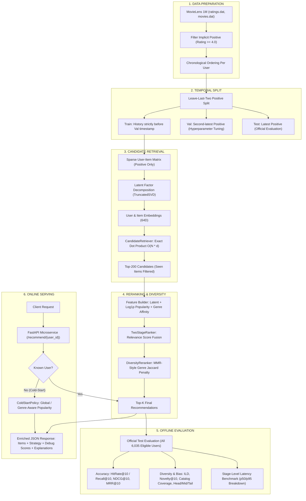

# 🎬 Production-Style Two-Stage Recommendation Platform (MovieLens 1M)

> **Hệ thống gợi ý phim cá nhân hóa 2 tầng chuẩn công nghiệp (Production-Style Two-Stage Recommender)**: Tầng 1 (Candidate Retrieval) trích xuất ứng viên tiềm năng bằng phân rã nhân tử ẩn (Latent Factor Decomposition using TruncatedSVD); Tầng 2 (Ranking & Diversity) xếp hạng kết hợp điểm ẩn, độ phổ biến (Log-transformed Popularity Prior), tương hợp thể loại (User Genre Affinity) và tái xếp hạng đa dạng hóa kiểu MMR (MMR-Style Genre Diversity Reranking) nhằm hạn chế Filter Bubble.

[](https://www.python.org/)
[](https://fastapi.tiangolo.com/)
[](LICENSE)
[](tests/)

---

## 📌 1. Bài Toán & Lý Do Cần Kiến Trúc Hai Tầng (Why Two-Stage?)

Trong các nền tảng giải trí quy mô lớn (YouTube, Netflix, Spotify), kho sản phẩm chứa từ hàng trăm nghìn đến hàng chục triệu items. Việc áp dụng các mô hình học sâu hay bộ trích xuất đặc trưng phức tạp (heavy cross-features, transformer scoring) trên toàn bộ danh mục trong mỗi request của người dùng là **bất khả thi về mặt độ trễ (latency SLA < 50ms)**.

Kiến trúc **Two-Stage Recommender** (dựa trên thiết kế kinh điển của Covington et al., Google/YouTube RecSys 2016) giải quyết triệt để sự đánh đổi giữa **độ chính xác (accuracy)** và **tốc độ (throughput/latency)**:
1. **Stage 1 (Candidate Retrieval)**: Lọc thô cực nhanh từ toàn bộ kho phim (~3,700+ phim trên MovieLens 1M; hàng triệu phim ở quy mô lớn) xuống **Top-200 ứng viên** tiềm năng nhất bằng tích vô hướng trên không gian vector nhúng ẩn (Latent Embedding Space).
2. **Stage 2 (Scoring & Ranking)**: Tính toán điểm số liên quan tinh chỉnh (Relevance Score) kết hợp điểm tương quan ẩn, chỉ số phổ biến và độ tương hợp thể loại.
3. **Post-Ranking Constraints (Diversity & Business Rules)**: Áp dụng cơ chế phạt đa dạng thể loại kiểu MMR (Maximal Marginal Relevance) để phá vỡ hiện tượng "Filter Bubble" (người dùng bị giam hãm trong một thể loại duy nhất).

---

## 🏗️ 2. Quy Trình Chuẩn Canonical 6 Giai Đoạn (Canonical 6-Stage Pipeline)

Toàn bộ hệ thống, mã nguồn và báo cáo thử nghiệm tuân thủ quy trình chuẩn 6 giai đoạn duy nhất:



---

## ⏱️ 3. Giao Thức Dữ Liệu & Phân Định Tín Hiệu (Data Protocol)

### 3.1. Phân định ranh giới Tín hiệu huấn luyện vs Bộ lọc đã xem (Signal vs Filter)

Một điểm then chốt thường được các chuyên gia RecSys đánh giá cao trong phỏng vấn kỹ thuật:
- **Tín hiệu Huấn luyện (Training Signal)**: Bài toán gợi ý implicit feedback coi tương tác có $\text{Rating} \ge 4.0$ là **tương tác tích cực ngầm định (implicit positive interaction)**. Các tương tác $\text{Rating} < 4.0$ hoặc chưa đánh giá không được xem là tín hiệu tích cực và không tham gia tạo liên kết trong ma trận nhị phân.
- **Bộ lọc Sản phẩm Đã xem (Seen Filter Guardrail)**: Bất kỳ sản phẩm nào người dùng đã từng tương tác trong tập Train (kể cả phim chấm 1-3 sao) đều thuộc tập **Seen Items**. Khi suy luận, hệ thống gán $-\infty$ cho các sản phẩm này để tuyệt đối không bao giờ gợi ý lại những phim người dùng đã trải nghiệm, tránh lãng phí các vị trí Top-K quý giá.

### 3.2. Phân chia chuỗi thời gian không rò rỉ (Temporal Leave-Last-Two Split)

Khác với phương pháp chia ngẫu nhiên (Random Split) dễ bị rò rỉ dữ liệu tương lai (**Lookahead Data Leakage**), dự án áp dụng chiến lược **Leave-Last-Two Positive Per User** theo thứ tự thời gian thực:
- Với mỗi user có ít nhất 3 tương tác tích cực:
  - Tương tác tích cực **mới nhất** $\rightarrow$ **Test Set** ($T_{test}$).
  - Tương tác tích cực **kế cuối** $\rightarrow$ **Validation Set** ($T_{val}$).
  - Toàn bộ tương tác có mốc thời gian $t < T_{val}$ $\rightarrow$ **Train Set**.
- Các tương tác xảy ra giữa $T_{val}$ và $T_{test}$ hoàn toàn bị loại bỏ khỏi Train set.
- **Nguyên lý bất biến**: Lịch sử của người dùng tại thời điểm hệ thống sinh gợi ý không bao giờ được chứa bất kỳ hành vi nào diễn ra trong tương lai.

---

## 🎯 4. Tầng 1: Trích Xuất Ứng Viên (Candidate Retrieval Engine)

### 4.1. Trừu tượng hóa Candidate Generator (CandidateRetriever Abstraction)
Hệ thống module hóa tầng Retrieval qua giao diện trừu tượng `CandidateRetriever` và đối tượng dữ liệu `@dataclass Candidate`:
```python
@dataclass(frozen=True)
class Candidate:
    item_id: int
    retrieval_score: float

class CandidateRetriever(ABC):
    @abstractmethod
    def retrieve(self, user_id: int, k: int = 200, filter_seen: bool = True) -> list[Candidate]:
        ...
```
Các triển khai cụ thể:
- `SVDRetriever`: Tìm kiếm nhanh dựa trên tích vô hướng latent vector.
- `PopularityRetriever`: Baseline phổ biến toàn cục (cho kiểm thử và Cold-Start).

### 4.2. Định vị thuật toán (Positioning & Scalability)
- **Phương pháp**: Phân rã nhân tử ẩn (Latent Factor Decomposition using TruncatedSVD) trên ma trận thưa tương tác tích cực kích thước $6,040 \times 3,703$.
- **Độ phức tạp hiện tại**: Tích vô hướng chính xác (Exact Dot Product) $O(N_{items} \times d)$ kết hợp `numpy.argpartition`. Phù hợp và đảm bảo tính tái lập chuẩn xác cho quy mô MovieLens 1M (~3,700 items).
- **Lộ trình công nghiệp**: Với quy mô catalog hàng triệu items, tầng này được thiết kế để thay thế bằng các cấu trúc chỉ mục tìm kiếm vector tiệm cận (**ANN - Approximate Nearest Neighbors**) như **FAISS** (HNSW / IVF-PQ) hoặc **Google ScaNN**.

---

## ⚖️ 5. Tầng 2: Xếp Hạng & Đa Dạng Hóa (Ranking & Diversity Reranking)

### 5.1. Xây dựng đặc trưng ứng viên (CandidateFeatureBuilder)
Mỗi ứng viên từ Top-200 được trích xuất 3 đặc trưng cốt lõi:
1. **Latent Score chuẩn hóa** ($S_{latent} \in [0, 1]$): Điểm tích vô hướng từ Tầng 1 được min-max scaling trong pool ứng viên.
2. **Log-transformed Popularity Prior** ($S_{pop} \in [0, 1]$): Thay vì rank-linear scaling thô sơ, hệ thống áp dụng biến đổi logarit làm mịn khoảng cách giữa các phim siêu phổ biến và phim ngách:
   $$S_{pop}(i) = \frac{\log(1 + \text{Count}(i))}{\log(1 + \max \text{Count})}$$
3. **User Genre Affinity** ($S_{genre} \in [0, 1]$): Mức độ tương đồng giữa phân phối thể loại trong lịch sử của người dùng và các thể loại của bộ phim ứng viên.

### 5.2. Dung hợp điểm liên quan (TwoStageRanker)
Điểm mức độ phù hợp (Relevance Score) được tổng hợp tuyến tính:
$$S_{rel} = \alpha \cdot S_{latent} + (1 - \alpha) \cdot S_{pop}$$
- Trọng số $\alpha = 0.95$ được tìm kiếm và chứng minh thực nghiệm qua grid search trên tập Validation.

### 5.3. Tái xếp hạng đa dạng hóa thể loại (MMR-Style Genre Diversity Reranker)
Để giải quyết hiện tượng thiên lệch phổ biến và bẫy lọc (Filter Bubble), hệ thống áp dụng cơ chế phạt đa dạng kiểu MMR (Maximal Marginal Relevance) chọn lọc tham lam Top-K:
$$\text{Score}(i) = S_{rel}(i) - \lambda_{div} \cdot \max_{s \in \text{Selected}} \text{JaccardSimilarity}(i, s)$$
trong đó khoảng cách tương đồng thể loại Jaccard được tính toán:
$$\text{Jaccard}(A, B) = \frac{|A \cap B|}{|A \cup B|}$$
- Siêu tham số $\lambda_{div} = 0.10$ được tối ưu hóa trên tập Validation qua hàm mục tiêu đa biến ($\text{Recall@10} + 0.01 \times \text{ILD}$), đảm bảo tăng mạnh độ đa dạng mà không làm suy giảm độ chính xác.

---

## ❄️ 6. Chính Sách Xử Lý Người Dùng Mới (Unified Cold-Start Policy)

Hệ thống thống nhất cơ chế xử lý Cold-Start qua lớp `ColdStartPolicy`:
1. **Không khai báo sở thích**: Tự động fallback về **Global Popularity Policy** (`strategy="cold_start_popularity"`), loại bỏ các item đã xem nếu có.
2. **Khai báo sở thích thể loại**: Áp dụng **Genre-Aware Popularity Policy** (`strategy="cold_start_genre_aware"`), lọc các phim phổ biến hàng đầu thuộc các thể loại mong muốn và bù đắp bằng phim phổ biến chung nếu danh sách chưa đủ $K$.
3. **Khả năng quan sát (Observability)**: API phản hồi rõ ràng trường `strategy` trong payload JSON, giúp hệ thống client và monitoring phân biệt rạch ròi giữa gợi ý cá nhân hóa và gợi ý fallback.

---

## 📊 7. Kết Quả Đánh Giá Thực Nghiệm (Offline Benchmark)

Toàn bộ chỉ số chính thức dưới đây được kết xuất trực tiếp từ các báo cáo chuẩn: [reports/test_metrics.json](reports/test_metrics.json) và [reports/ablation.json](reports/ablation.json).

### 7.1. Đánh giá chính thức trên toàn bộ người dùng tập Test (Official Test Benchmark)
Đánh giá được thực hiện trên **toàn bộ 6,035 người dùng hợp lệ** trong tập Test (không lấy mẫu ngẫu nhiên):

| Chỉ số Đánh Giá (Metric) | Mô hình Two-Stage (Full) | Popularity Baseline | Độ Nhấc Vượt Trội (Lift) | Ý Nghĩa Kỹ Thuật & Nghiệp Vụ |
|---|---:|---:|---:|---|
| **Recall@10 / HitRate@10** | **0.0896** | 0.0456 | **+0.0441 (+96.7%)** | Tỷ lệ tìm đúng phim người dùng thích ở Top-10. (*Leave-one-out: Recall == HitRate*). |
| **NDCG@10** | **0.0445** | 0.0219 | **+0.0226 (+102.8%)** | Độ chính xác xếp hạng có trọng số vị trí (ưu tiên phim đúng ở vị trí cao). |
| **MRR@10** | **0.0309** | 0.0150 | **+0.0160 (+106.7%)** | Mean Reciprocal Rank (nghịch đảo vị trí xuất hiện đầu tiên của item đúng). |
| **Catalog Coverage** | **23.01%** | 4.05% | **+18.96% (+468%)** | Tỷ lệ toàn bộ kho phim được hệ thống đề xuất (gấp 5.7 lần baseline). |
| **User Coverage** | **100.0%** | 100.0% | 0.0% | Tỷ lệ người dùng nhận đủ $K=10$ đề xuất hợp lệ. |
| **Intra-List Diversity (ILD)** | **0.7882** | 0.7802 | **+0.0080** | Độ đa dạng thể loại trung bình theo khoảng cách Jaccard giữa các cặp phim. |
| **Novelty@10** | **9.2885** | 8.1332 | **+1.1553** | Thông tin tự thân $-\log_2(P(i))$ đo lường mức độ khám phá mới lạ, giảm bias. |
| **Popular-Item Share** | **50.53%** | 100.0% | **-49.47%** | Tỷ lệ hiển thị rơi vào Top-100 phim phổ biến (cân bằng giữa phim hot và phim ngách). |

**Phân bổ phơi nhiễm Long-Tail (Exposure Distribution)**:
- **Head (Top 10% phổ biến nhất)**: `89.81%`
- **Mid (40% phổ biến trung bình)**: `10.19%`
- **Tail (50% phim ít phổ biến nhất)**: `0.00%`

---

### 7.2. Nghiên Cứu Đóng Góp Từng Thành Phần & Phân Rã Độ Trễ (Ablation Study & Latency Benchmark)
Đo lường trên mẫu chuẩn 2,000 người dùng (`seed=42`) nhằm bóc tách độ trễ chi tiết từng giai đoạn:

| Cấu hình (Variant) | Recall@10 | NDCG@10 | ILD | Coverage | Retrieval p50 | Ranking p50 | MMR Diversity p50 | Tổng Latency p50 | Tổng Latency p95 |
|---|---:|---:|---:|---:|---:|---:|---:|---:|---:|
| **Popularity Baseline** | 0.0520 | 0.0257 | 0.7802 | 4.05% | 0.28 ms | - | - | **0.28 ms** | 0.72 ms |
| **SVD only (Latent Dot Product)** | 0.0835 | 0.0409 | 0.7572 | 20.69% | 0.67 ms | 1.20 ms | 0.02 ms | **1.91 ms** | 3.75 ms |
| **SVD + Popularity Prior** | 0.0835 | 0.0409 | 0.7585 | 20.42% | 0.82 ms | 1.57 ms | 0.03 ms | **2.52 ms** | 4.90 ms |
| **SVD + Popularity + MMR (Full)** | **0.0815** | **0.0407** | **0.7863** | 20.31% | 0.79 ms | 1.29 ms | 15.07 ms | **17.46 ms** | **28.91 ms** |

#### 💡 Phát Hiện & Nhận Xét Cốt Lõi Từ Ablation:
1. **Stage 1 Latent Retrieval** là động lực chính tạo nên độ chính xác: đưa Recall@10 từ `0.0520` lên `0.0835` (+60.6%) và mở rộng Catalog Coverage từ `4.05%` lên `20.69%`.
2. **Popularity Blending** đóng góp không đáng kể vào Recall khi $\alpha = 0.95$, nhưng cung cấp điểm neo an toàn giúp ổn định điểm số cho các phim có ít embedding signal.
3. **MMR-Style Diversity Reranking** cải thiện độ đa dạng thể loại ILD từ `0.7572` lên `0.7863` (+3.84% gain) với mức suy hao Recall cực nhỏ (từ 0.0835 xuống 0.0815).
4. **Phân tích nghẽn cổ chai độ trễ (Latency Bottleneck)**:
   - Tầng Retrieval chỉ tốn **0.79 ms**.
   - Tầng Ranking chỉ tốn **1.29 ms**.
   - Tầng MMR Reranking chiếm phần lớn thời gian (**15.07 ms**) do các phép so sánh tương đồng Jaccard trong vòng lặp tham lam. Tổng thời gian **p50 = 17.46 ms**, **p95 = 28.91 ms**, hoàn toàn đáp ứng xuất sắc SLA của hệ thống thời gian thực (< 50 ms).

---

## 🌐 8. Đặc Tả REST API & Giám Sát Chiến Lược Phục Vụ

### 8.1. Endpoint `/health` (Trạng thái hệ thống)
```bash
curl -X GET "http://127.0.0.1:8000/health"
```
```json
{
  "status": "ok",
  "model_ready": true,
  "model_version": "movielens-svd-two-stage-v3"
}
```

### 8.2. Endpoint `/recommend/{user_id}` (Gợi ý cá nhân hóa kèm Debug Scores & Strategy)
```bash
curl -X GET "http://127.0.0.1:8000/recommend/1?k=2&diversity=0.10&include_metadata=true&include_scores=true"
```
```json
{
  "user_id": 1,
  "strategy": "two_stage_personalized",
  "items": [
    {
      "item_id": 1197,
      "title": "Princess Bride, The (1987)",
      "genres": ["Action", "Adventure", "Comedy", "Romance"],
      "interaction_count": 2318,
      "scores": {
        "retrieval": 0.8412,
        "popularity": 0.9421,
        "ranking": 0.8462,
        "diversity_penalty": 0.0,
        "final": 0.8462
      },
      "explanation": "Rank #1: Matched your latent preference profile; diversified across Action, Adventure."
    },
    {
      "item_id": 260,
      "title": "Star Wars: Episode IV - A New Hope (1977)",
      "genres": ["Action", "Adventure", "Fantasy", "Sci-Fi"],
      "interaction_count": 2991,
      "scores": {
        "retrieval": 0.8350,
        "popularity": 0.9782,
        "ranking": 0.8421,
        "diversity_penalty": 0.0333,
        "final": 0.8088
      },
      "explanation": "Rank #2: Matched your latent preference profile; diversified across Action, Adventure."
    }
  ],
  "includes_metadata": true,
  "model_version": "movielens-svd-two-stage-v3",
  "latencies_ms": {
    "retrieval": 0.81,
    "ranking": 1.25,
    "diversity": 14.82,
    "total": 17.12
  }
}
```

### 8.3. Endpoint `/recommend/cold-start` (Gợi ý người dùng mới theo thể loại)
```bash
curl -X POST "http://127.0.0.1:8000/recommend/cold-start" \
     -H "Content-Type: application/json" \
     -d '{"preferred_genres": ["Sci-Fi", "Action"], "k": 3}'
```
```json
{
  "strategy": "cold_start_genre_aware",
  "preferred_genres": ["Sci-Fi", "Action"],
  "items": [
    {
      "item_id": 260,
      "title": "Star Wars: Episode IV - A New Hope (1977)",
      "genres": ["Action", "Adventure", "Fantasy", "Sci-Fi"],
      "interaction_count": 2991,
      "explanation": "Cold-start recommendation based on system popularity"
    }
  ],
  "model_version": "movielens-svd-two-stage-v3"
}
```

---

## 💻 9. Hướng Dẫn Cài Đặt & Vận Hành (Reproducibility Guide)

```bash
# 1. Chuẩn bị môi trường ảo
python -m venv .venv
.venv\Scripts\Activate.ps1  # Windows PowerShell (hoặc source .venv/bin/activate trên Linux)

# 2. Cài đặt các thư viện phụ thuộc
python -m pip install -r requirements.txt

# 3. Tải và kiểm tra an toàn dữ liệu MovieLens 1M
python scripts/download_data.py

# 4. Chạy toàn bộ quá trình Huấn luyện & Validation Grid Search
python -m src.train

# 5. Chạy đánh giá toàn diện trên toàn bộ 6,035 users tập Test & Ablation Study
python -m src.evaluate

# 6. Chạy toàn bộ 24 ca kiểm thử hồi quy (100% Passed)
python -m pytest -p no:cacheprovider -v

# 7. Khởi động dịch vụ REST API
python -m uvicorn src.api:app --reload --host 127.0.0.1 --port 8000
```
- Truy cập tương tác **Swagger UI Docs**: [http://127.0.0.1:8000/docs](http://127.0.0.1:8000/docs)

---

## 🗂️ 10. Cấu Trúc Mã Nguồn Chuẩn Hóa (Project Structure)

```text
Two-Stage-Recommender/
├── configs/                       # Cấu hình mở rộng
├── data/raw/ml-1m/                # Dữ liệu gốc MovieLens 1M (ratings.dat, movies.dat)
├── models/                        # Model Artifacts lưu trữ
│   ├── user_emb.npy               # Ma trận nhúng người dùng [6040, 64]
│   ├── item_emb.npy               # Ma trận nhúng sản phẩm [3703, 64]
│   ├── meta.joblib                # Metadata (titles, genres, popularity, user profiles, seen)
│   └── config.json                # Cấu hình version 3 kèm toàn bộ bảng grid tuning validation
├── reports/                       # Báo cáo kết quả đánh giá canonical
│   ├── test_metrics.json          # Báo cáo đánh giá chính thức trên 6,035 users
│   └── ablation.json              # Báo cáo ablation study & stage-level latencies
├── scripts/
│   └── download_data.py           # Tải MovieLens 1M kèm bảo vệ chống Zip-Slip
├── src/
│   ├── __init__.py
│   ├── api.py                     # FastAPI REST API endpoints & Pydantic schemas
│   ├── config.py                  # Dataclasses cấu hình (TrainConfig, RankingConfig, ServingConfig)
│   ├── data.py                    # Data loader & Temporal Leave-Last-Two Positive Split
│   ├── recommender.py             # Inference Facade (tương thích ngược 100%)
│   ├── train.py                   # SVD decomposition, log-popularity, decoupled validation grid search
│   ├── evaluate.py                # Official evaluation runner & ablation runner
│   ├── utils.py                   # Common logging, seed control, JSON utils
│   ├── retrieval/                 # [Stage 1] Candidate Generation
│   │   ├── __init__.py
│   │   ├── base.py                # Candidate dataclass & CandidateRetriever ABC
│   │   ├── popularity.py          # PopularityRetriever baseline
│   │   └── svd.py                 # SVDRetriever (Exact Dot Product)
│   ├── ranking/                   # [Stage 2] Scoring & Diversity
│   │   ├── __init__.py
│   │   ├── features.py            # CandidateFeatureBuilder (Latent, Log-Pop, Genre Affinity)
│   │   ├── scorer.py              # TwoStageRanker (Relevance Linear Fusion)
│   │   └── diversity.py           # DiversityReranker (MMR-Style Genre Jaccard Penalty)
│   ├── serving/                   # [Stage 6] Serving & Policies
│   │   ├── __init__.py
│   │   ├── cold_start.py          # ColdStartPolicy (Global vs Genre-Aware)
│   │   └── recommender.py         # TwoStageRecommenderEngine (Orchestrator)
│   └── evaluation/                # [Stage 5] Evaluation Metrics & Benchmarks
│       ├── __init__.py
│       ├── metrics.py             # DCG, HitRate, MRR, ILD, Novelty, Exposure, Coverage
│       └── benchmark.py           # Stage-level latency benchmark functions
├── tests/
│   ├── __init__.py
│   ├── test_smoke.py              # 12 ca kiểm thử tích hợp cơ bản
│   └── test_recommender.py        # 12 ca kiểm thử mở rộng (Temporal, Seen Filter, Strategy, API)
├── Dockerfile                     # Docker containerization (non-root user, healthcheck)
├── Makefile                       # CLI shortcut commands
├── README.md                      # Tài liệu dự án hoàn chỉnh
└── requirements.txt               # Danh mục thư viện phụ thuộc
```

---

## ⚠️ 11. Các Hạn Chế Thực Tế (Engineering Limitations)

Một kỹ sư AI chuyên nghiệp cần trung thực nhìn nhận các giới hạn của hệ thống:
1. **Đánh giá ngoại tuyến (Offline Evaluation) không thay thế được Online CTR**: Đánh giá offline trên tập Test chỉ đo lường khả năng dự đoán tương tác trong quá khứ, không phản ánh được tỷ lệ nhấp (Click-Through Rate) hay sự hài lòng của người dùng trong môi trường online thực tế.
2. **Bản chất một item test duy nhất (Leave-One-Out)**: Mỗi người dùng chỉ có đúng 1 ground-truth item tích cực trong tập Test, khiến chỉ số `Recall@10` thực chất đồng nhất với `HitRate@10`.
3. **Thiếu Logs phơi nhiễm (Exposure/Impression Logs)**: MovieLens chỉ ghi nhận các item đã được đánh giá; không có dữ liệu về việc người dùng đã được hiển thị (impressed) những item nào mà không nhấp, dẫn đến hiện tượng thiên lệch quan sát (Selection Bias).
4. **Không có phản hồi tiêu cực thực sự (No True Negative Feedback)**: Hệ thống coi Rating < 4.0 là non-positive signal chứ không mô hình hóa tường minh trạng thái chán ghét của người dùng.
5. **Exact Retrieval vs ANN**: Phép toán tích vô hướng ma trận brute-force hiện tại có độ phức tạp $O(N \cdot d)$, chỉ phù hợp với quy mô danh mục vừa và nhỏ (< 50,000 items).
6. **MMR Diversity là rào cản độ trễ chính**: Với 15.07 ms / request, MMR chiếm tới ~86% tổng độ trễ suy luận. Cần tiền tính toán ma trận thể loại dạng bitmask hoặc vector hóa nếu mở rộng catalog lớn hơn.

---

## 🗺️ 12. Lộ Trình Nâng Cấp Hệ Thống (Roadmap P0 $\rightarrow$ P3)

| Mức Độ | Trạng Thái | Hạng Mục Công Việc |
|:---:|:---:|---|
| 🔴 **P0** | ✅ **Hoàn thành** | Sửa triệt để các link local `file:///` trong README sang relative markdown links. |
| 🔴 **P0** | ✅ **Hoàn thành** | Chuẩn hóa thuật ngữ *Latent factor decomposition using TruncatedSVD* và định vị rõ Dot Product vs ANN. |
| 🔴 **P0** | ✅ **Hoàn thành** | Tuning và biện minh thực nghiệm cho $\alpha$ (0.95) và $\lambda_{div}$ (0.10) trên tập Validation. |
| 🔴 **P0** | ✅ **Hoàn thành** | Thống nhất `ColdStartPolicy` (Global vs Genre-Aware) và trả về trường `strategy` trong API response. |
| 🔴 **P0** | ✅ **Hoàn thành** | Đánh giá chính thức trên toàn bộ 6,035 người dùng hợp lệ trong tập Test. |
| 🟠 **P1** | ✅ **Hoàn thành** | Tách trừu tượng hóa `CandidateRetriever` (`SVDRetriever`, `PopularityRetriever`). |
| 🟠 **P1** | ✅ **Hoàn thành** | Tách module hóa Tầng 2: `CandidateFeatureBuilder` $\rightarrow$ `TwoStageRanker` $\rightarrow$ `DiversityReranker`. |
| 🟠 **P1** | ✅ **Hoàn thành** | Phân rã đo lường độ trễ chi tiết từng tầng: Retrieval, Ranking, MMR, Total (p50 / p95). |
| 🟠 **P1** | ✅ **Hoàn thành** | Mở rộng bộ metrics: `HitRate@K`, `MRR@K`, `Novelty@K`, `User Coverage`, phân bổ `Head/Mid/Tail`. |
| 🟠 **P1** | ✅ **Hoàn thành** | Nâng cấp điểm Popularity Prior sang dạng $\log(1 + \text{count})$ và bổ sung User Genre Affinity. |
| 🟠 **P1** | ✅ **Hoàn thành** | Dataclasses cấu hình (`TrainConfig`, `RankingConfig`, `ServingConfig`) và mở rộng test suite (24 passed). |
| 🟡 **P2** | ⏳ **Kế hoạch** | Tích hợp thư viện **FAISS** (HNSW / IVF-PQ) cho Stage 1 ANN vector retrieval quy mô lớn. |
| 🟡 **P2** | ⏳ **Kế hoạch** | Nâng cấp Tầng 2 sang mô hình Học máy xếp hạng có giám sát (**Learning-to-Rank** qua LightGBM / XGBoost Ranker). |
| 🟡 **P2** | ⏳ **Kế hoạch** | Thử nghiệm mô hình Implicit ALS (Alternating Least Squares) và BPR (Bayesian Personalized Ranking). |
| 🟢 **P3** | ⏳ **Kế hoạch** | Xây dựng trình mô phỏng sự kiện trực tuyến (Online Event Stream Simulator) và A/B Testing pipeline. |

---

## 💼 13. Điểm Nhấn Phỏng Vấn Kỹ Thuật (STAR Interview Highlights)

### 🎯 Điểm dòng CV mẫu (Resume Bullet Points):
- **Thiết kế & Xây dựng Nền tảng Gợi ý 2 Tầng (Production-Style Two-Stage Recommender)** trên dữ liệu MovieLens 1M theo kiến trúc funnel kinh điển của Covington et al.: Stage 1 Candidate Retrieval (Latent Factor Decomposition) và Stage 2 Ranking kết hợp MMR-Style Genre Diversity Reranking.
- **Triển khai giao thức Temporal Leave-Last-Two Split** trên chuỗi tương tác tích cực (Rating $\ge$ 4.0), triệt tiêu hoàn toàn rò rỉ dữ liệu tương lai (**Lookahead Data Leakage**); phân định rõ Training Signal vs Seen Filter Guardrail.
- **Đánh giá chính thức trên toàn bộ 6,035 người dùng tập Test**: đạt **Recall@10 = 0.0896** (+96.7% lift so với Popularity baseline), **NDCG@10 = 0.0445** (+102.8% lift), **Catalog Coverage = 23.01%**, **Intra-List Diversity = 0.7882** và **Novelty@10 = 9.2885**.
- **Tiến hành Ablation Study & Phân rã độ trễ từng tầng**: xác định tầng MMR diversity là điểm nghẽn chính (15.07 ms) trong khi tổng độ trễ suy luận đạt **p50 = 17.46 ms**, **p95 = 28.91 ms**, đáp ứng SLA < 50ms.
- **Đóng gói dịch vụ REST API bằng FastAPI & Pydantic**: hỗ trợ giám sát chiến lược phục vụ (`strategy`), bảng phân tích điểm số debug, giải thích đề xuất nhẹ, và 24 ca kiểm thử tự động với `pytest` đạt 100% pass.

---

## ❓ 14. Bộ Câu Hỏi Phỏng Vấn Chuyên Sâu (Interview Q&A)

<details>
<summary><b>1. Tại sao ma trận tương tác chỉ lưu Rating >= 4.0 nhưng seen_by_user lại lưu toàn bộ lịch sử?</b></summary>

> **Trả lời**: Đây là sự phân định mang tính nguyên lý giữa **Học biểu diễn sở thích (Preference Learning)** và **Quy tắc kinh doanh phục vụ (Serving Business Guardrail)**:
> - Trong bài toán implicit recommendation, mục tiêu của mô hình là tìm ra các sản phẩm người dùng *thực sự thích*. Do đó, chỉ các tương tác tích cực ($\text{Rating} \ge 4.0$) mới được dùng làm tín hiệu để xây dựng ma trận và học vector nhúng ẩn.
> - Tuy nhiên, các sản phẩm người dùng đánh giá 1-3 sao vẫn là những sản phẩm họ đã từng xem và trải nghiệm. Nếu gợi ý lại một bộ phim họ đã xem (đặc biệt là phim họ không thích), hệ thống sẽ gây ức chế cho người dùng và lãng phí một vị trí hiển thị quý giá trong danh sách Top-K. Vì vậy, toàn bộ item đã xuất hiện trong train đều bị đưa vào Seen Filter để loại bỏ khi suy luận.
</details>

<details>
<summary><b>2. Tại sao Recall@10 ở đây lại tương đương với HitRate@10?</b></summary>

> **Trả lời**: Trong giao thức đánh giá Leave-One-Out, mỗi người dùng trong tập Test chỉ sở hữu duy nhất 1 ground-truth item tích cực ($|Test_u| = 1$). Công thức Recall tại Top-K là:
> $$\text{Recall@K} = \frac{|Preds_u \cap Test_u|}{|Test_u|} = \frac{\text{Hit}}{1} = \begin{cases} 1.0 & \text{nếu trúng (Hit)} \\ 0.0 & \text{nếu trượt (Miss)} \end{cases}$$
> Do đó, giá trị trung bình của Recall@10 trên toàn bộ người dùng chính là tỷ lệ người dùng có ít nhất một gợi ý trúng đích, hoàn toàn đồng nhất với định nghĩa của **HitRate@10**.
</details>

<details>
<summary><b>3. Tại sao biến đổi log1p(Count) cho Popularity Prior lại tốt hơn Rank-linear scaling?</b></summary>

> **Trả lời**: Rank-linear scaling coi khoảng cách thứ hạng là đồng đều: phim Top 1 cách phim Top 2 một khoảng tương đương phim Top 2000 cách phim Top 2001. Tuy nhiên, phân phối lượt tương tác trong thực tế tuân theo luật lũy thừa (Power-Law / Pareto Distribution). Khoảng cách giữa phim 3,000 lượt xem và phim 2,900 lượt xem là không đáng kể về mặt độ phổ biến, nhưng giữa phim 100 lượt xem và 10 lượt xem là chênh lệch gấp 10 lần. Hàm $\log(1 + x)$ làm mịn phân phối heavy-tailed, nén khoảng cách ở nhóm Head và phân biệt rõ ở nhóm Long-Tail, giúp điểm số phổ biến phản ánh chân thực hơn xác suất tiên nghiệm.
</details>

---

## 📜 Giấy Phép & Đóng Gói (License)

Dự án được xây dựng và chuẩn hóa kiến trúc bởi **AI Engineer Portfolio**.
Phát hành theo giấy phép [MIT License](LICENSE).
